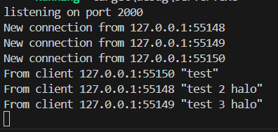
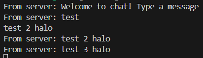

## 2.1

- Server

- Client 1

- Client 2
 

- Client 3
 

This program is a chatting program that runs asynchronously. To run the server use `cargo run --bin server` and to run the client use `cargo run --bin client`. If one of the clients sends a message, it will go to the server and sent back to other clients asynchronously.