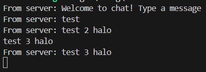

## 2.1

- Server


- Client 1


- Client 2
 

- Client 3
 

This program is a chatting program that runs asynchronously. To run the server use `cargo run --bin server` and to run the client use `cargo run --bin client`. If one of the clients sends a message, it will go to the server and sent back to other clients asynchronously.

## 2.2

To modify the port, we need to modify both the server and the client to use the port 8080. The server uses TcpListener to listen to any connection, so we modify the binding from 

```    
let listener = TcpListener::bind("127.0.0.1:2000").await?;
    println!("listening on port 2000");
```

to

```    
let listener = TcpListener::bind("127.0.0.1:8080").await?;
    println!("listening on port 8080");
```

And on the client we modify from

```
let (mut ws_stream, _) = ClientBuilder::from_uri(Uri::from_static("ws://127.0.0.1:2000"))
        .connect()
        .await?;
```

to 

```
let (mut ws_stream, _) = ClientBuilder::from_uri(Uri::from_static("ws://127.0.0.1:8080"))
        .connect()
        .await?;
```

## 2.3


To add some information about the IP of the client, we simply pass not just the text sent by the client, but also the client's IP.

So, in server.rs instead of 

```
if let Some(text) = msg.as_text() {
        println!("From client {addr:?} {text:?}");
        bcast_tx.send(text.into())?;
}
```

it becomes 

```
if let Some(text) = msg.as_text() {
        println!("From client {addr:?} {text:?}");
        bcast_tx.send(format!("{addr} : {text}"))?;
}
```

And to add `Matt's Computer -` on each message we simply add it on client.rs

```
if let Some(text) = msg.as_text() {
    println!("Matt's Computer - From server: {}", text);
}
``` 